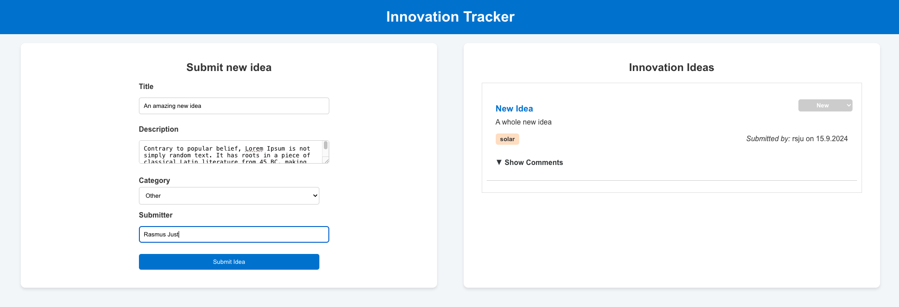

# Innovation Ideas App

The **Innovation Ideas App** is a web-based platform that allows users to submit, review, and comment on innovative ideas related to renewable energy, particularly in fields like solar, wind, and energy storage. The app is built using a tech stack that includes **FastAPI** for the backend and **React** for the frontend, with **SQLite** for database interaction.

This project has been containerized using Docker and Docker Compose, allowing easy deployment and local development in an isolated environment.

---

## Features

- **Idea Submission:** Users can submit their innovative ideas, categorized under different energy sectors.
- **Commenting:** Each idea can be discussed through comments from different users.
- **Status Management:** Each idea has a status that can be updated by the admins to reflect its current progress.
- **Categorization:** Ideas are categorized to allow easy filtering and browsing. (Not implemented in frontend)
- **Responsive UI:** A modern and responsive user interface built using React.

---

## Architecture

The application is structured into the following components:

1. **Backend (FastAPI):**
   - Manages all server-side logic, including idea submission, status management, and comment handling.
   - Provides RESTful APIs that the frontend interacts with.
   _ Documentation of endpoins is provided in the backend UI.

2. **Frontend (React):**
   - Provides an intuitive and responsive UI for users to submit, view, and comment on ideas.
   - Communicates with the backend through **Axios**.

3. **Database:**
   - The app uses **SQLite** as the database for storing ideas and comments, this is served as part of the backend, and is not build from a seperate Dockerfile.

4. **Docker and Docker Compose:**
   - The app is containerized using Docker. ```docker compose``` is used to orchestrate the services (backend, frontend, and database) in isolated containers.


---

## Setup

### Prerequisites

Before setting up the app, ensure you have the following installed:

- [Docker](https://www.docker.com/)
- [Docker Compose](https://docs.docker.com/compose/)

### Building and Running the App with Docker Compose

This project uses Docker Compose to orchestrate the different services, including the FastAPI backend, React frontend, and PostgreSQL database. Follow these steps to get the app running:

1. **Clone the Repository:**
Start by cloing the repo
    ```bash
    git clone https://github.com/rasmusjust91/energy_innovation_app.git
    cd energy_innovation_app
    ```

2. **Build and Run the app**
To build the app run the following:
    ```bash
    docker compose up --build
    ```
3. **Access the Application**
Once the application is up and running, you can access it via the following URLs:
    - **Frontend**: http://localhost:3000
    - **Backend API**: http://localhost:8000
    - **API Docs (Swagger UI)**: http://localhost:8000/docs For documentation of the API
    - **Redoc**: http://localhost:8000/redoc For documentation of the API

4. **Stop the containers**
If you want to stop the services, run:
    ```bash
    docker compose down
    ```

## Frontend
The React frontend is designed to provide users with a clean and intuitive interface to interact with the app. 



The frontend is comprised of the following main components:

- IdeaList Component:
    Displays all submitted ideas, sorted by the most recent.
    Each idea includes a title, description, status, as well as the user and date of submission.
- Submit Idea Form:
    Allows users to submit new ideas to the platform.
- Comments Section
    Displays comments for each idea. Users can add new comments or view existing ones.

## Testing the backend 
To ensure stable endpoints, unit test have been implemented, and are located in backend/test. The tests are executed locally by the following steps:

1. Navigate to backend dir
    ```bash
    cd backend
    ```
2. Run pytest
    ```ash
    pytest
    ```
If pytest is not locally installed, do so by either running ```pip install -r requirements.txt``` or simply ```pip install pytest```

## TODOs

1. Implement filtering, search and sorting the idea list in the frontend
2. Bugfix the too loarge comment boxes in the commentssection for each idea
3. Implement  auth
4. Using the auth for a user allows for the deletion of the Author boxes, and  can be automated
5. Create delete idea end point that deletes idea and corresponding comments
6. Make it possible to delete the idea and comments from the frontend, if the delete idea and delete comment endpoints are implemented
7. Add put endpoints for editing category, title, description, as well as  comments